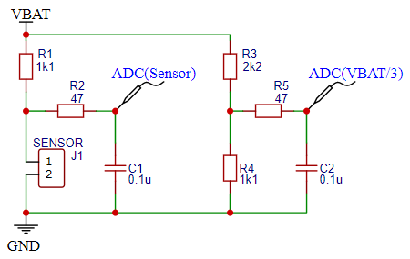

# esp32-level-sensor

This project is used to read a level sensor (water / fuel) that has different discrete resistance values depending on the height of the float. In this project a sensor has been used with 240Ω (max height) - 30Ω (min height).

## Schematic and Readings

Via an ESP32's ADCs and voltage dividers the sensor as well as the battery voltage is measured. Sensor reading is put in relation to battery voltage reading to reduce influence of decreasing battery voltage over the time.



The following table shows the values and according sensor height that have been manually read and measured. Based on that I've derived sections with linear interpolation in between:


To compute interpolating polymomial WolframAlpha's [interpolating polynomial calculator](https://www.wolframalpha.com/input/?i=interpolating+polynomial+calculator&assumption=%7B%22F%22%2C+%22InterpolatingPolynomialCalculator%22%2C+%22data2%22%7D+-%3E%22%7B%7B2110%2C0%7D%2C%7B1903%2C2.5%7D%7D%22) was a great help:

| Height [cm] | ADC(Sensor) / ADC(VBAT/3) | Linearization points                      |
| ----------- | ------------------------- | ----------------------------------------- |
| 0           | 0,658                     | linear fit {{0.658, 0}, {0.595, 2.5}}     |
| 1,1         | 0,626                     |                                           |
| 2,5         | 0,595                     | linear fit {{0.595, 2.5}, {0.448, 13.4}}  |
| 4,6         | 0,562                     |                                           |
| 7           | 0,534                     |                                           |
| 9,3         | 0,507                     |                                           |
| 11,3        | 0,477                     |                                           |
| 13,4        | 0,448                     | linear fit {{0.448, 13.4}, {0.316, 25.9}} |
| 15,4        | 0,427                     |                                           |
| 17,6        | 0,406                     |                                           |
| 19,6        | 0,383                     |                                           |
| 21,8        | 0,362                     |                                           |
| 23,8        | 0,34                      |                                           |
| 25,9        | 0,316                     | linear fit {{0.316, 25.9}, {0.198, 51.2}} |
| 32,3        | 0,287                     |                                           |
| 38,8        | 0,258                     |                                           |
| 45          | 0,228                     |                                           |
| 51,2        | 0,198                     | linear fit {{0.198, 51.2}, {0.135, 68.1}} |
| 59,5        | 0,166                     |                                           |
| 68,1        | 0,135                     | linear fit {{0.135, 68.1}, {0.0086, 94}}  |
| 76,5        | 0,0938                    |                                           |
| 84,8        | 0,0511                    |                                           |
| 94          | 0,0086                    | X                                         |

## Software

```C++
#include <Arduino.h>

void setup()
{
  Serial.begin(115200);
  while (!Serial) {}  // wait for serial port to connect. Needed for native USB
  pinMode(D3, OUTPUT);
  analogSetAttenuation(ADC_0db);
  digitalWrite(D3, HIGH); // Spannungsteiler wird über D3 versorgt.
}

uint32_t analogSample(uint8_t pin, uint16_t samples)
{
  uint32_t avg = 0;
  for (int i = 0; i < samples; i++)
  {
    uint16_t a = analogRead(pin);
    avg = avg + a;
  }
  avg = avg / samples;
  return avg;
}

int32_t lastAvg = 0;
int32_t state = 0;

void loop()
{
  int32_t a = (int32_t)analogSample(A0, 256);
  if (state == 0 && abs(a - lastAvg) > 10)
  {
    state = 1;
  }
  if (state == 1 && abs(a - lastAvg) < 10)
  {
    state = 0;
    Serial.printf("%d\n", a);
  }
  lastAvg = a;
}
```
